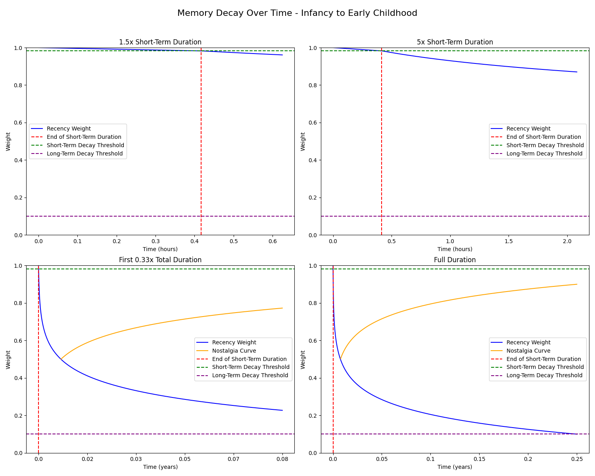
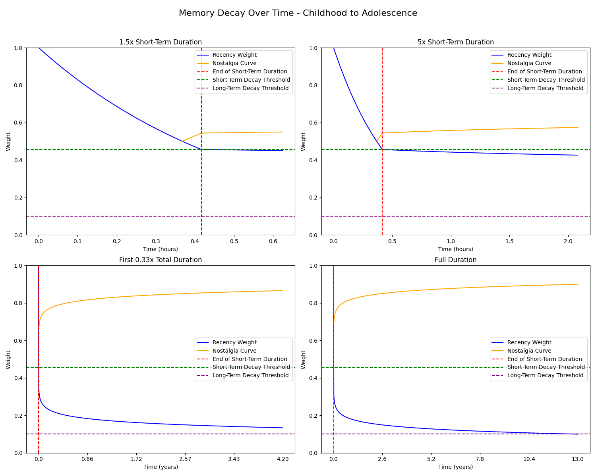
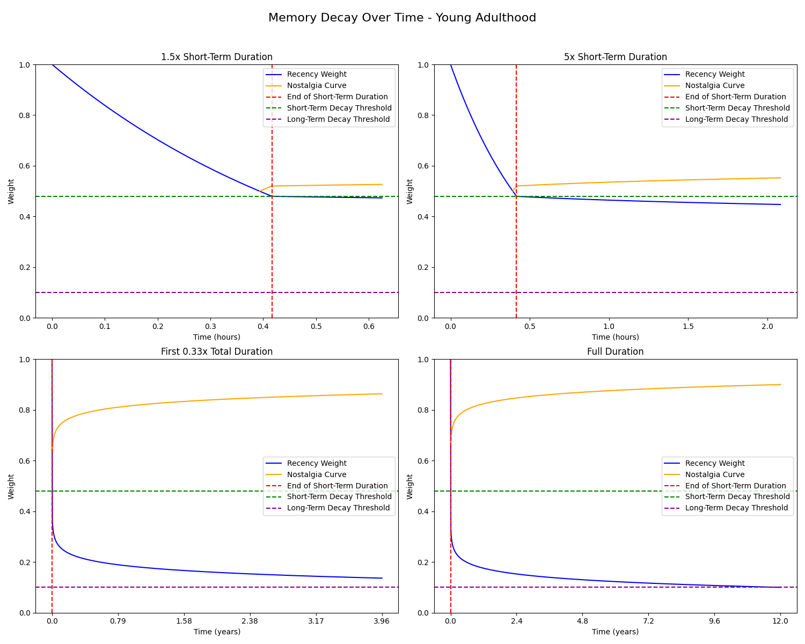
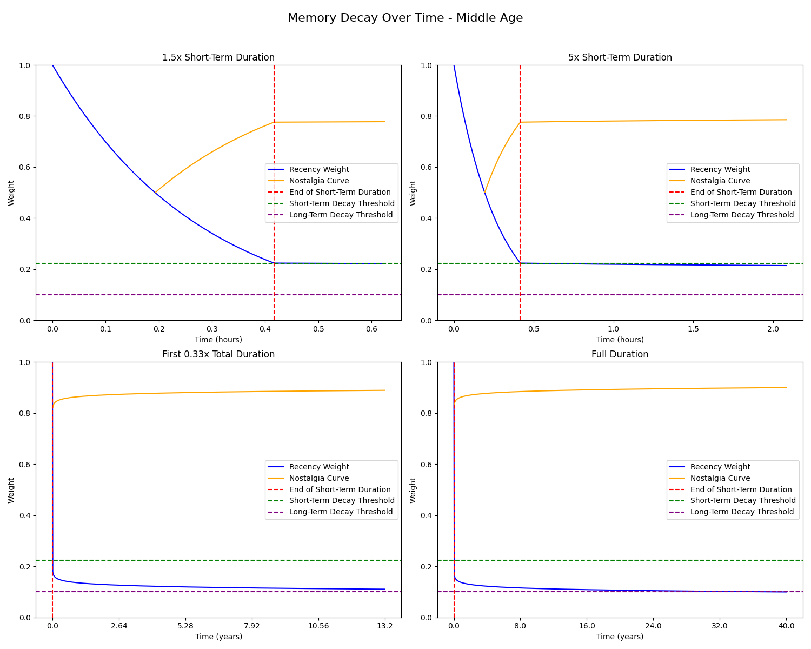
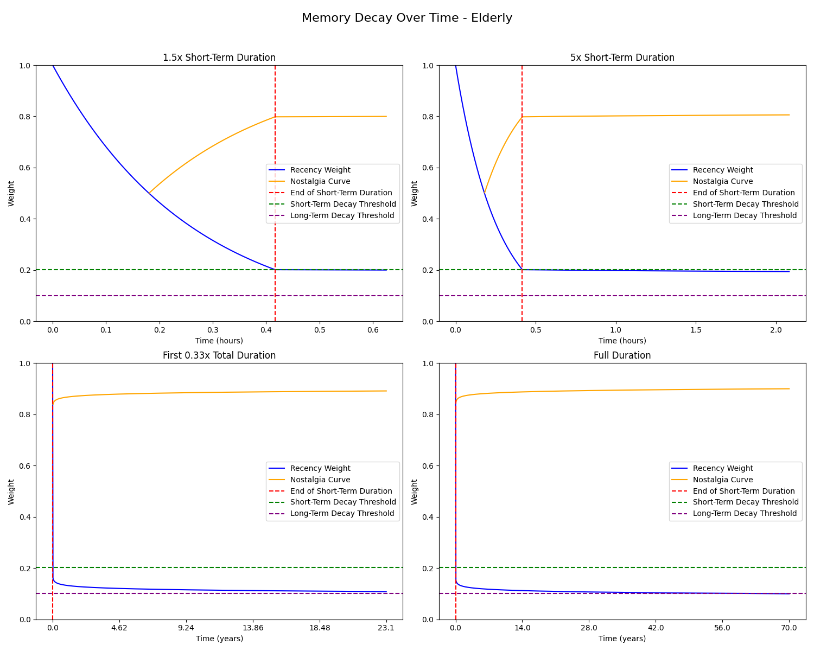
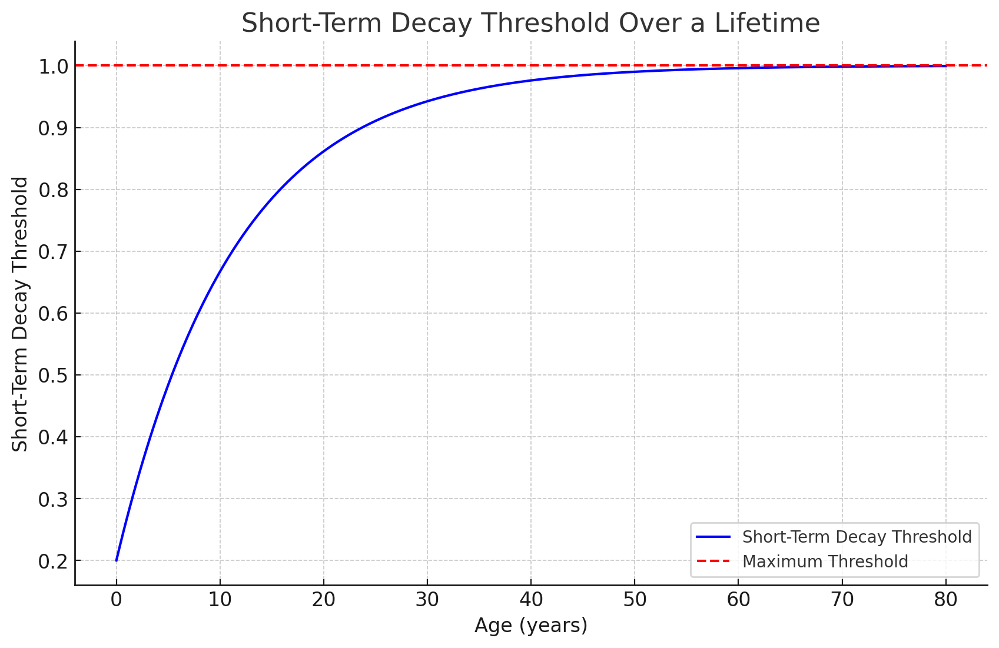
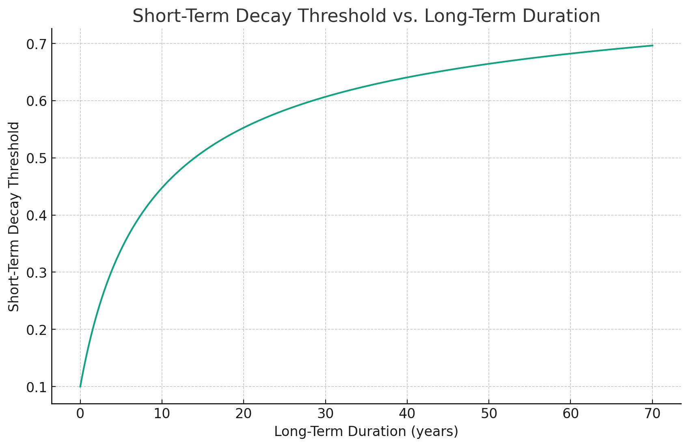
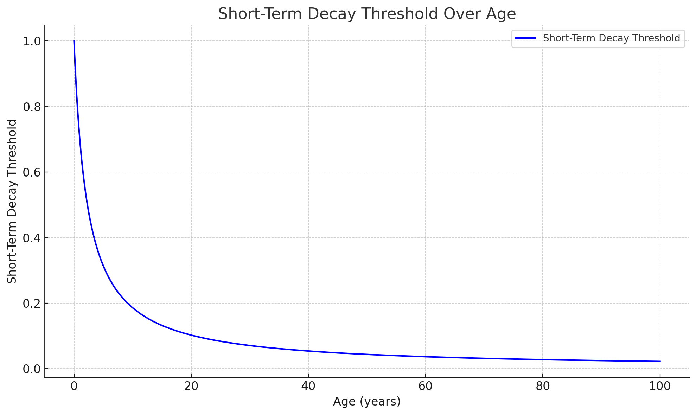
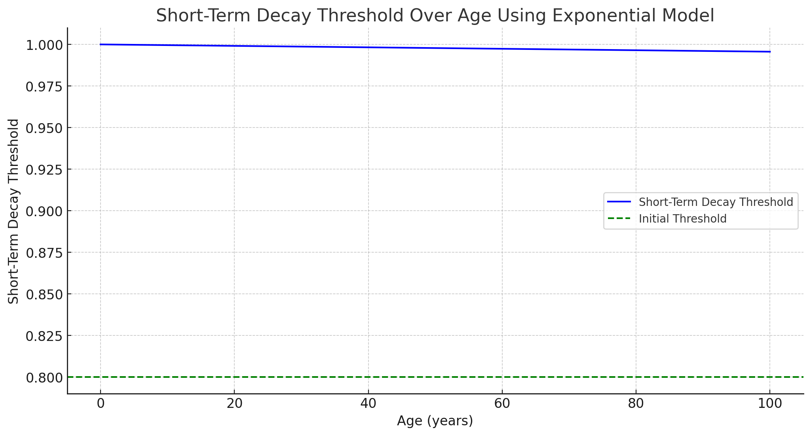

# Exocortex Memory Model

The Exocortex's memory model prioritizes both the recency and relevance of memories, seeking to emulate the human brain's intricate balance between recalling recent experiences and older but more relevant memories.

## Memory Weighting

The curves for short-term and long-term memories are exponential and logarithmic respectively, normalizing and adapting to both the oldest long-term memory and the short-term memory duration specified by the user.

In the Exocortex, each memory's weight is determined by three factors:
1. **Relevance**: Measured by the cosine similarity between the query embedding for two memories, this captures the semantic distance. We grab all memories related to content in the short-term context and cluster them together as recollections, adding to the short term context. 
2. **Recency**: A modified forgetting curve that differentiates between short-term and long-term memories and dynamically adjusts to maintain consistent memory curves as the Exocortex grows, while capturing how the strength of a memory decays over time.
3. **Type**: Different types of memories (e.g., core, recalled with context, reaction) might have different weights that can be set. Recollections often contain a broader context, and are given a slight boost over the more detailed core or reaction memories.

### Adjusting for Relevance over Recency

To ensure that older memories are given an equal chance of being recalled if they are relevant, the weighting formula was adjusted.

In the original paper "Generative Agents: Interactive Simulacra of Human Behavior"[^1], they directly multiplying the weights:

```cs
var finalWeight = relevance * recency * typeWeight;
```
The formula was changed to:

```cs
var nostalgiaWeight = 1 - ComputeRecencyScore(memory.CreationTimestamp); // Inverse of recency
var finalWeight = ((relevance * nostalgiaWeight) + recency) * typeWeight;
```

The nostalgiaWeight is an inverse of the recency score, acting as a counterbalance. This change ensures that while recent memories are naturally prioritized, older but relevant memories aren't overshadowed. By taking a weight sum instead, a low recency score won't bring down a high relevancy score.

Further, it was noted that if you observe these curves at the ages of early adolescence (10-14) to young adult (16-20), the intersection point of the recency and nostalgia weight (where the nostalgia weight first kicks in) will slowly move into the short-term memory, slowing as it approaches the age of ~25-30. This gives it a small boost to relevant memories that are about to fade rapidly, and may contribute to an overall heightened performance with larger short-term memory.

See [these plots](./5days%20to%2030years). This requires further research, but has the potential to increase short-term memory performance and negate the ill effects of the short-term memory getting very large in higher ages. Ideally, we want this effect to happen sooner than it would in a real human, though it's unclear if this is mathematically feasibile in the current system.

## Memory Clustering

In the Exocortex, memories are not just stored as individual units but are grouped together based on their content similarity, forming clusters. This clustering mechanism is vital for efficient memory retrieval and to mimic the human brain's capability to group related memories, thereby providing context to current experiences.

### How Clustering Works

1. **Gathering Long-term Memories**: Starting with the most recent short-term memories (including the new prompt), each short-term memory pulls in the most recent and relevant memories to it from the long-term.
1. **Formation of Clusters**: Given the found relevant long-term memories and scores, we expand the number of memories clustered to `MaxRelatedRecollectionClusterMemories * NumberOfDimensions`, reduce it to `NumberOfDimensions` with Umap, then cluster it. Each cluster is sorted by the computed memory weight in relation to the new memory, and only `MaxRelatedRecollectionClusterMemories` are taken in each cluster. 
2. **Memory Cluster Summaries**: Now that we have our clusters, we can summarize each one using the abstract `SummarizeMemoryInNewContext` method (implemented by the LLM or another system) and create a recollection memory. These summaries are reflections of the memories within the cluster, rooted in the same context of the prompt but augmented with slight variations based on the memories within the cluster. The summarization mechanism has since been briefly explored and confirmed in an academic setting. See "Recursively Summarizing Enables Long-Term Dialogue Memory in Large Language Models."[^4].
3. **Use the new recollection memories**: The act of recalling and summarizing memories is itself stored as a new memory in the Exocortex. Being a recent memory, it is highly likely to retrieved for the final reaction memory, unless another memory with a higher weight is found to replace it.

### Overcoming Confabulation

A significant challenge in AI memory models is avoiding confabulation – where the system creates false memories by merging different memories together. The Exocortex's clustering mechanism addresses this by ensuring that:

- Memory clusters are similar to the prompt but different from each other.
- The clustered summaries reflect that, all rooted in the same idea augmented with a slightly different context.
- Since recollections are also treated as short-term memories, when re-inserted into short-term context, LLMs have been observed to "reads between the lines" across these similar clusters of memories, further preventing confabulation, especially effectively when summaries highlight the time and date events in the recollection happen.

### Detailed Clustering Process

<details><summary>The process of memory clustering in the Exocortex is a series of well-defined steps that ensure memories are grouped effectively:</summary>

1. **Embedding Generation**:
   - For every new memory or prompt, an embedding vector is generated. This vector represents the content of the memory in a form that can be used to compute similarities with other memories.
   - Embeddings are crucial for the clustering mechanism as they condense the content of memories into a format that allows for efficient comparison.

2. **Memory Similarity Computation**:
   - The Exocortex computes the similarity between the embedding of the new memory and the embeddings of all existing memories.
   - This step identifies which memories are relevant to the current prompt and should be considered for clustering.

3. **Dimensionality Reduction using UMAP**:
   - Given the high-dimensional nature of memory embeddings, it's essential to reduce their dimensionality for efficient clustering.
   - UMAP (Uniform Manifold Approximation and Projection) is used to reduce the dimensionality of embeddings, preserving as much of the local and global structure as possible.

4. **Memory Clustering with HDBSCAN**:
   - The dimensionality-reduced embeddings are then clustered using the HDBSCAN algorithm.
   - HDBSCAN (Hierarchical Density-Based Spatial Clustering of Applications with Noise) groups memories based on their density in the embedding space. It's particularly suited for data with varying cluster densities and can identify noise (memories that don't belong to any cluster).

5. **Cluster Summarization**:
   - For each cluster identified, a representative summary is generated. This summary encapsulates the common themes or content of all memories within the cluster.
   - The summary is rooted in the context of the original prompt but contains nuances from all memories in the cluster. 

6. **Storing Recollections**:
   - The act of recalling and summarizing memories is itself stored as a new memory in the Exocortex.
   - This ensures that the context and nuances of every recollection are preserved and can influence future recalls.

By following this structured approach, the Exocortex ensures that memories are not only stored efficiently but also recalled in a manner that preserves their context and relevance.
</details>

## Finished curves

Our findings plotted over various lifespans, from infancy to old age.

Plotted with a long-term decay threshold of 0.1 and a short-term duration of 25 minutes. Can be tweaked and generated again using [./mem_chartsv2.py](./mem_chartsv2.py).

| Infancy to Early Childhood      | Childhood to Adolescence      | Young Adulthood             |
| ------------------------------ | ---------------------------- | --------------------------- |
|  |  |  |

| Middle Age                     | Elderly                      |
| ------------------------------ | ---------------------------- |
|  |  |

## Decay Rate and Threshold functions 

**Set by the end user**:
- Short-term memory duration 
- Long-term decay threshold
- The rest is calculated based on these two values

---

**Short-term Memory Decay**:
- **Function**: Exponential decay
- **Rationale**: Captures the rapid fading of recent memories, consistent with how short-term human memories fade quickly.

**Long-term Memory Decay**:
- **Function**: Reversed logarithmic decay
- **Rationale**: Mimics human memory patterns where memories fade slowly over time but never completely disappear. The initial rapid decay slows down, representing the long-lasting nature of certain memories.

---

**Short-term Decay Threshold**:

- **Value**: Computed using an exponential function based on the long term duration.
- **Function**: Exponential
- **Role**: Represents the point at which short-term memories start transitioning to long-term memories. As more long-term memories accumulate, the threshold decreases, leading short-term memories to decay faster.
- **Challenge & Solution**: 
    - It was observed after computing this based on long-term duration that the max possible threshold (1) was being approached exponentially with age, leading to rapid memory loss around age 45.
    - The issue stems from how we were dynamically adjusting the short-term decay threshold based on the long-term duration. As the long-term duration increases (i.e., as someone gets older), the short-term decay threshold increases, which leads to a noticeable loss of short-term memory, eventually losing it entirely.
    - To address this, we treated short-term decay threshold as a function of long-term memory duration, using a logarithmic function.
    - This resulted in a more gradual increase in the short-term decay threshold, which in turn led to a _significantly_ more gradual loss of short-term memory.

| Before (exponential)             | After (logistic)             |
| -------------------------------- | ---------------------------- |
|  |  |

---

**Long-term Decay Threshold**:
- **Value**: Constant at 0.01, can be changed by user.
- **Function**: Exponential
- **Role**: Represents the minimum strength a long-term memory can have. It's the point below which a memory is considered lost or inaccessible.
- **Rationale**: Mimics the idea that some human memories, no matter how old, never completely vanish but can become very hard to access.
- **Challenge & Solution**:
  - After making the short-term decay threshold climb exponentially with age (countering the memory loss caused by the purely exponential curve), we noted the functional inverse of our last problem was happening in the lower bounds instead of the upper - the difference between the short term decay threshold and the long-term decay threshold was being approached logistically.
  - This resulted in a flattening and decline in long-term memory strength. The strength of long-term memories were being squeezed into a very small range of possible strength.
  - This was rectified by applying an exponential function to counter it, which resulted in a long-term memory curve that may be stable beyond the charted 100 years (see "Elderly" chart above).

| Before (logistic)                                      | After (exponential)                                  |
| ------------------------------------------------------- | ---------------------------------------------------- |
|  |  |


[^1]: Joon Sung Park and Joseph C. O'Brien and Carrie J. Cai and Meredith Ringel Morris and Percy Liang and Michael S. Bernstein (2023). Generative Agents: Interactive Simulacra of Human Behavior. arXiv preprint [arXiv:2304.03442](https://arxiv.org/abs/2304.03442).
[^4]: Qingyue Wang, Liang Ding, Yanan Cao, Zhiliang Tian, Shi Wang, Dacheng Tao, Li Guo (2023). "Recursively Summarizing Enables Long-Term Dialogue Memory in Large Language Models." arXiv preprint [arXiv:2308.15022](https://arxiv.org/abs/2308.15022).
