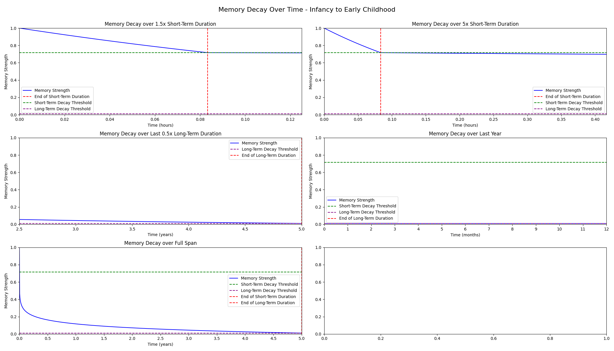
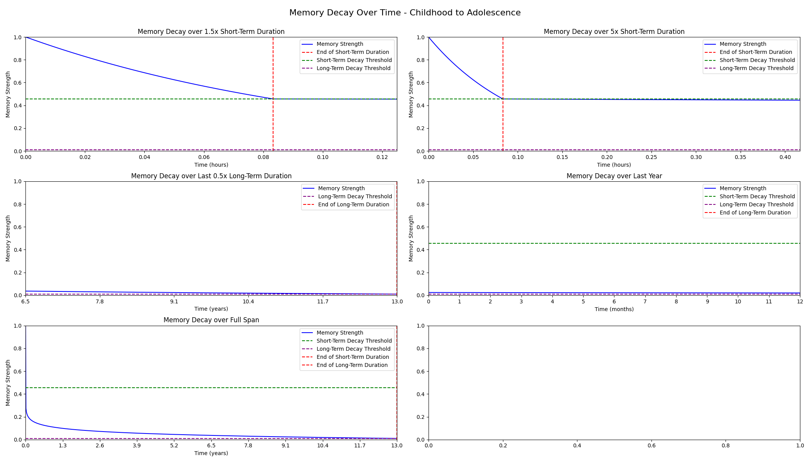
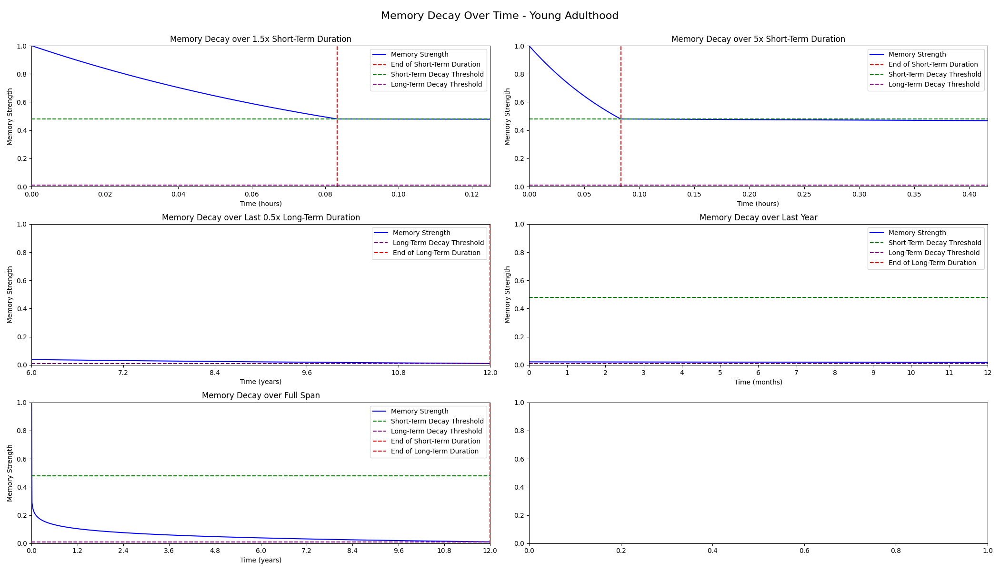
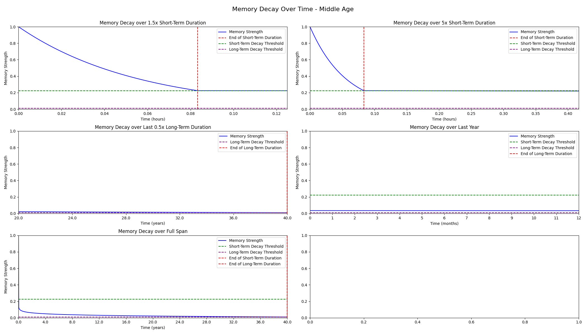
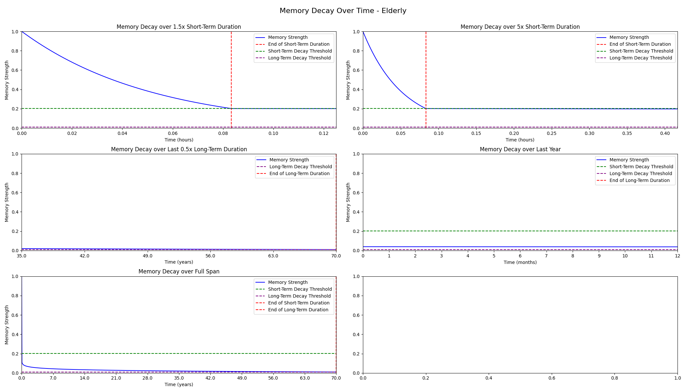

# Exocortex Memory Model

The curves for short-term and long-term memories are exponential and logarithmic respectively, normalizing and adapting to both the oldest long-term memory and the short-term memory duration specified by the user.
   
## Finished curves

Our findings plotted over various lifespans, from infancy to old age. 

 

    
    
    

 

## Decay Rate and Threshold functions 

**Set by the end user**:
- Short-term memory duration 
- Long-term decay threshold
- The rest is calculated based on these two values

---

**Short-term Memory Decay**:
- **Function**: Exponential decay
- **Rationale**: Captures the rapid fading of recent memories, consistent with how short-term human memories fade quickly.

**Long-term Memory Decay**:
- **Function**: Reversed logarithmic decay
- **Rationale**: Mimics human memory patterns where memories fade slowly over time but never completely disappear. The initial rapid decay slows down, representing the long-lasting nature of certain memories.

---

**Short-term Decay Threshold**:

- **Value**: Computed logistically using the long term duration.
- **Function**: Logistic
- **Role**: Represents the point at which short-term memories start transitioning to long-term memories. As more long-term memories accumulate, the threshold decreases, leading short-term memories to decay faster.
- **Challenge & Solution**: 
    - It was observed after computing this based on long-term duration that the max possible threshold (1) was being approached exponentially with age, leading to rapid memory loss around age 45.
    - The issue stems from how we were dynamically adjusting the short-term decay threshold based on the long-term duration. As the long-term duration increases (i.e., as someone gets older), the short-term decay threshold increases, which leads to a noticeable loss of short-term memory, eventually losing it entirely.
    - To address this, we treated short-term decay threshold as a function of long-term memory duration, using a logarithmic function.
    - This resulted in a more gradual increase in the short-term decay threshold, which in turn led to a _significantly_ more gradual loss of short-term memory.

    Before (exponential)
    After (logistic)

    
    

---

 **Long-term Decay Threshold**:
- **Value**: Constant at 0.01, can be changed by user.
- **Function**: Exponential
- **Role**: Represents the minimum strength a long-term memory can have. It's the point below which a memory is considered lost or inaccessible.
- **Rationale**: Mimics the idea that some human memories, no matter how old, never completely vanish but can become very hard to access.
- **Challenge & Solution**:
  - By making the short-term decay threshold climb exponentially with age (countering the age 45 memory loss), we noted the functional inverse was happening - the difference between the short term decay threshold and the long-term decay threshold was being approached logistically.
  - This resulted in a flattening and decline in long-term memory strength. This was rectified by applying an exponential function to counter it.

    Before (logistic)
    After (exponential)

    
    

 